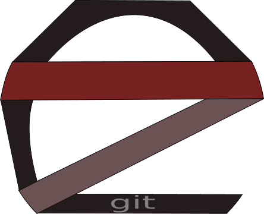
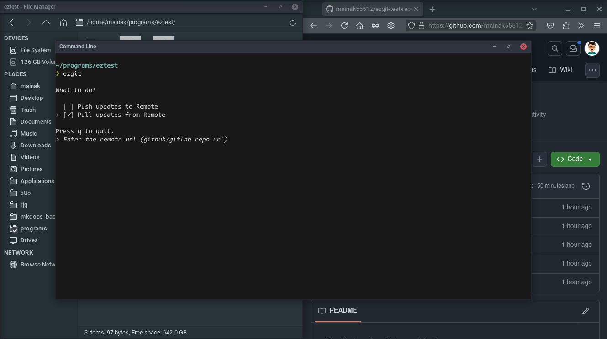
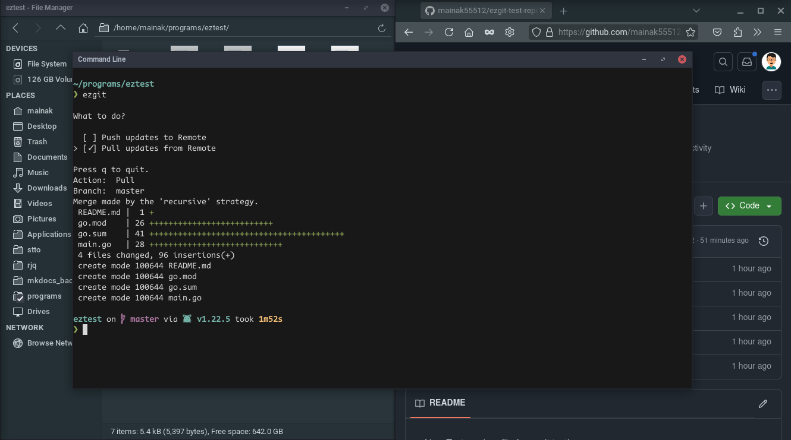

# EZGIT

Git CLI wrapper program for noobs.

## Authors

- [Mainak Bhattacharjee](https://github.com/mainak55512)

## Dependencies

- git v1.7 or higher

## Screenshots

### Please note: Only push and pull supported for now.

## 🚀 About Me
I'm a Tech enthusiast and a hobby programmer.
You can visit my [Github profile](https://github.com/mainak55512) to see my other works :)

